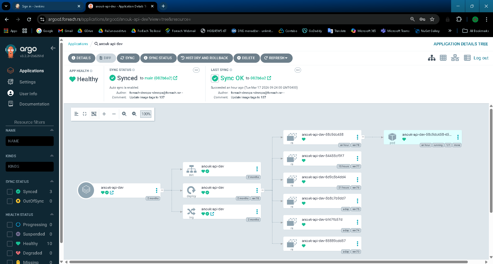
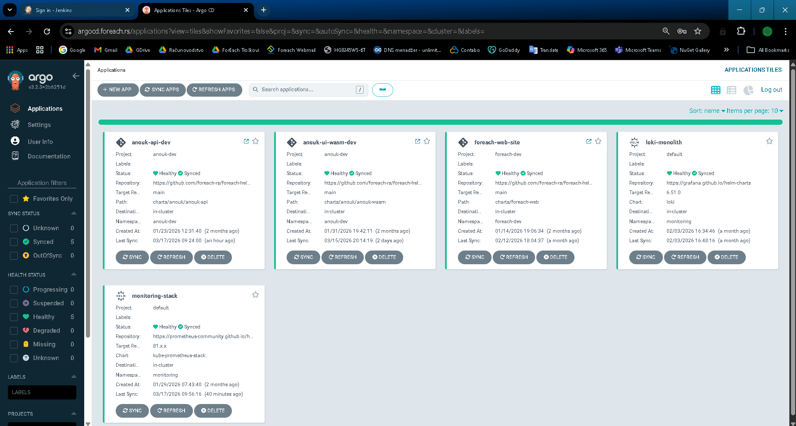
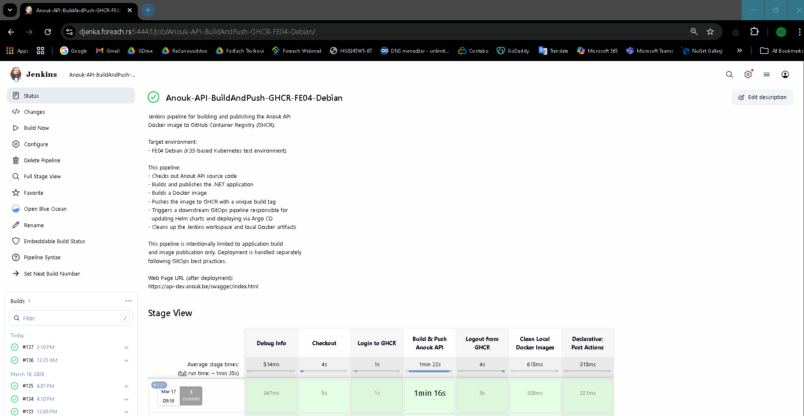
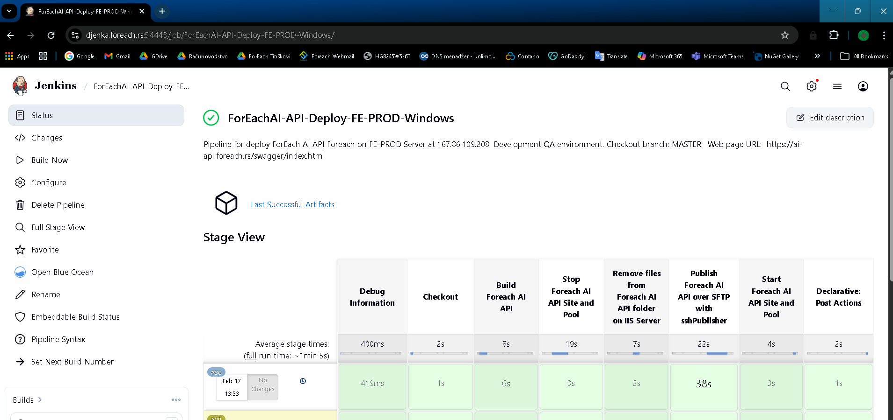

# DevOps Platform Demo

A real-world DevOps pipeline demonstrating end-to-end CI/CD, containerization, Kubernetes deployment, and GitOps — based on production work.

## Tech Stack

| Tool | Purpose |
|------|---------|
| Jenkins | CI/CD pipelines (build, push, deploy) |
| GitHub Actions | Cloud-native CI/CD alternative to Jenkins |
| Docker | Multi-stage containerization |
| Kubernetes (K3S) | Container orchestration |
| Helm | Kubernetes package management |
| Argo CD | GitOps continuous delivery |
| GHCR | GitHub Container Registry (image storage) |
| Traefik | Ingress controller |
| Discord | Pipeline notifications |

---

## Architecture

```
Developer pushes code
        │
        ▼
┌──────────────────────────────────────┐
│  CI  (Jenkins OR GitHub Actions)     │
│  Build & Push Pipeline               │
│  ──► dotnet publish                  │
│  ──► docker build                    │
│  ──► docker push → GHCR             │
└────────┬─────────────────────────────┘
         │ triggers downstream / next job
         ▼
┌─────────────────────┐
│  Helm Update        │  Jenkinsfile-helm-update / ci-cd.yml (job 2)
│  Pipeline (GitOps)  │  ──► checkout helm-charts repo
│                     │  ──► update image tag in values-dev.yaml
│                     │  ──► git commit & push
└────────┬────────────┘
         │ Git change detected
         ▼
┌─────────────────────┐
│  Argo CD            │  argocd/application.yaml
│  GitOps Sync        │  ──► detects values-dev.yaml change
│                     │  ──► helm upgrade on K3S cluster
│                     │  ──► new pod with updated image
└─────────────────────┘
```

---

## Repository Structure

```
devops-platform-demo/
│
├── app/
│   └── DemoWebApp/          # Minimal .NET 8 app (health endpoints)
│       ├── Program.cs
│       └── DemoWebApp.csproj
│
├── docker/
│   └── Dockerfile            # Multi-stage build (.NET SDK → ASP.NET runtime)
│
├── k8s/
│   ├── deployment.yaml       # Raw Kubernetes Deployment manifest
│   └── service.yaml          # ClusterIP Service
│
├── helm/
│   └── demo-web-chart/
│       ├── Chart.yaml
│       ├── values.yaml       # Default values (base)
│       ├── values-dev.yaml   # DEV overrides (image tag updated by CI)
│       └── templates/
│           ├── deployment.yaml
│           ├── service.yaml
│           └── ingress.yaml
│
├── jenkins/
│   ├── Jenkinsfile-build-push     # CI: build .NET app, build & push Docker image
│   ├── Jenkinsfile-helm-update    # GitOps: update Helm values, trigger ArgoCD sync
│   ├── Jenkinsfile-deploy-qa      # Traditional: SSH deploy to Windows IIS (QA)
│   └── Jenkinsfile-deploy-prod    # Traditional: SSH deploy to Windows IIS (PROD)
│
├── .github/
│   └── workflows/
│       └── ci-cd.yml         # GitHub Actions: build + push + helm update (GitOps)
│
├── argocd/
│   └── application.yaml      # ArgoCD Application pointing to helm-charts repo
│
└── README.md
```

---

## Pipeline Flows

### Modern GitOps Pipeline (K3S / Kubernetes)

Two equivalent implementations of the same pipeline — Jenkins and GitHub Actions:

1. **Build & Push**
   - Jenkins: `Jenkinsfile-build-push` — triggers via downstream job chain, tags image with `BUILD_NUMBER`
   - GitHub Actions: `ci-cd.yml` (job: `build-and-push`) — triggers on push to `main`, tags image with git SHA
   - Both: `dotnet publish` → `docker build` → push to GHCR

2. **Helm Update**
   - Jenkins: `Jenkinsfile-helm-update` — separate job, triggered by upstream build job
   - GitHub Actions: `ci-cd.yml` (job: `update-helm-chart`) — runs after `build-and-push`, uses `HELM_CHARTS_PAT` secret to write to a separate repo
   - Both: checkout `helm-charts` repo → update `image.tag` in `values-dev.yaml` → git commit & push

3. **Argo CD Sync** (`argocd/application.yaml`)
   - Watches the `helm-charts` repo for changes
   - Automatically runs `helm upgrade` on the K3S cluster
   - New pod is deployed with the updated image

### Traditional IIS Pipeline (Windows Server)

4. **Deploy QA** (`Jenkinsfile-deploy-qa`)
   - Used for environments without Kubernetes
   - Zero-downtime pattern: uploads `app_offline.htm` first (IIS maintenance mode)
   - Transfers published files via SSH/SFTP
   - Removes `app_offline.htm` to bring site back online
   - Sends Discord notifications on success/failure

5. **Deploy PROD** (`Jenkinsfile-deploy-prod`)
   - Same pattern as QA, targets production server
   - Branch: `master`

---

## Helm Chart Design

The chart uses **named resource profiles** instead of hardcoded resource values:

```yaml
# values.yaml
resourceProfiles:
  small:
    requests: { cpu: 100m, memory: 128Mi }
    limits:   { cpu: 300m, memory: 256Mi }
  medium:
    requests: { cpu: 200m, memory: 256Mi }
    limits:   { cpu: 500m, memory: 512Mi }

resources:
  profile: small   # switch profile per environment
```

This allows environment-specific tuning without duplicating resource blocks.

---

## Run Locally

```bash
# Build image
docker build -t demo-web-app -f docker/Dockerfile app/DemoWebApp/

# Run container
docker run -p 8080:80 demo-web-app

# Test endpoints
curl http://localhost:8080/
curl http://localhost:8080/health/live
curl http://localhost:8080/health/ready
```

---

## Key Concepts Demonstrated

- **Separation of concerns**: build pipeline vs. deployment pipeline are separate jobs (both in Jenkins and GitHub Actions)
- **GitOps**: the only way to trigger a deployment is a Git commit to the Helm repo — Argo CD handles the rest
- **Multi-environment Helm**: base `values.yaml` + per-environment overrides (`values-dev.yaml`)
- **Image tag as the deployment artifact**: CI writes the tag into Git; ArgoCD reads it from Git
- **Dual CI tooling**: same pipeline logic implemented in both Jenkins (Groovy) and GitHub Actions (YAML)
- **Dual deployment strategies**: modern GitOps (K8s) and traditional SSH-based (IIS) in the same repo
- **Security**: credentials never hardcoded — managed via Jenkins credential store or GitHub Actions secrets

---

## Screenshots

Production pipelines and ArgoCD deployments from a real K3S cluster environment.

### ArgoCD





### Jenkins




